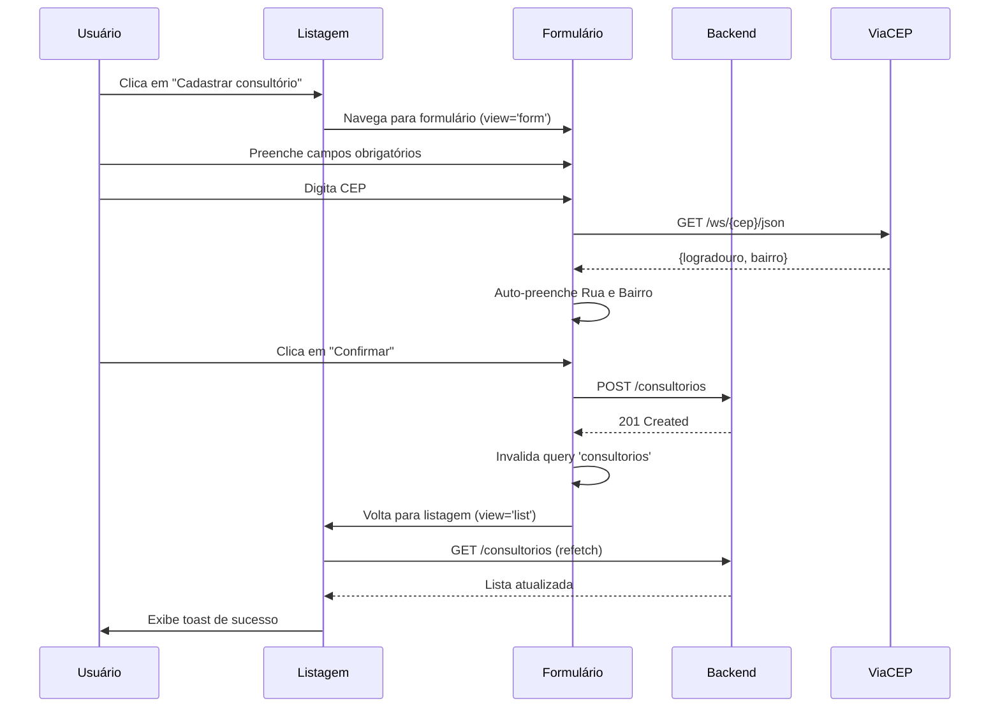
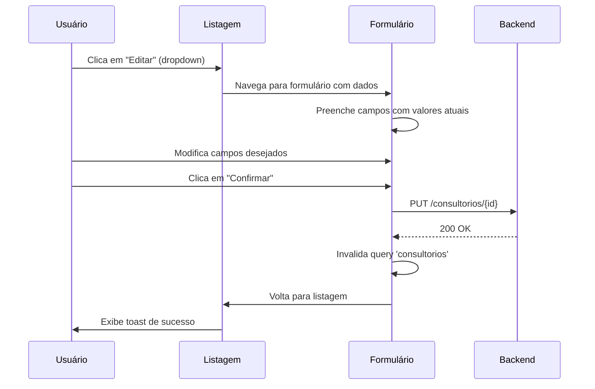
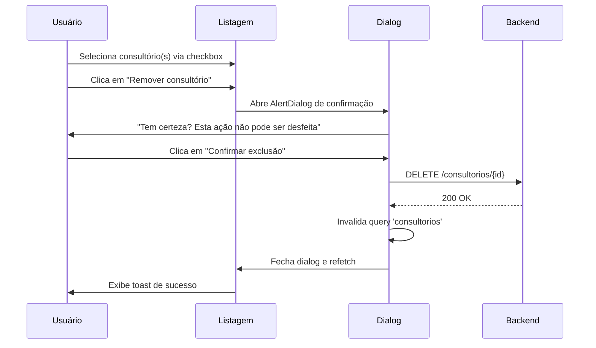

# 🏢 Feature Spec - Configurações de Consultório

**Data:** 01/11/2025  
**Status:** 📋 PLANEJAMENTO - Design de Arquitetura  
**Autor:** Especificação Técnica - Feature Implementation  
**Documento Pai:** [4-configuracoes.md](./4-configuracoes.md)

---

## 📋 Sumário Executivo

Este documento descreve a arquitetura e o plano de implementação para a funcionalidade de **Gestão de Consultórios** dentro da aba "Consultórios" da página de Configurações do AlignWork. Esta funcionalidade permite aos usuários cadastrar, listar e gerenciar os endereços físicos de seus consultórios/clínicas.

### 🎯 Objetivos:

- ✅ **Criar interface de listagem** de consultórios cadastrados
- ✅ **Implementar formulário de cadastro** com validação completa
- ✅ **Integrar API ViaCEP** para auto-preenchimento de endereço
- ✅ **Implementar filtro dinâmico** Estado → Cidades
- ✅ **Adicionar funcionalidade de remoção** de consultórios
- ✅ **Manter consistência visual** com a paleta AlignWork

### 🔗 Contexto no Sistema:

Esta funcionalidade está localizada em:
```
Configurações → Sidebar → Aba "Consultórios"
```

---

## 🏗️ Visão Geral da Arquitetura

### **Stack Tecnológica**

| Tecnologia | Uso |
|------------|-----|
| **React 18.3.1** | Framework principal |
| **TypeScript 5.8.3** | Type safety |
| **Tailwind CSS** | Estilização |
| **shadcn/ui** | Componentes UI |
| **React Hook Form** | Gerenciamento de formulários |
| **Zod** | Validação de schemas |
| **React Query** | State management e cache |
| **React Router DOM** | Navegação entre views |
| **Axios** | Requisições HTTP (ViaCEP) |

### **APIs Externas**

| API | Propósito | URL Base |
|-----|-----------|----------|
| **ViaCEP** | Auto-fill de endereço por CEP | `https://viacep.com.br/ws/{cep}/json/` |
| **IBGE** | Lista de estados e municípios | `https://servicodados.ibge.gov.br/api/v1/localidades/` |

---

## 🎨 Estrutura de Navegação

### **Fluxo de Navegação**

```
┌─────────────────────────────────────────────────────────────┐
│  Configurações (Settings.tsx)                               │
│  ├── Sidebar                                                │
│  │   ├── Perfil                                            │
│  │   ├── Permissões                                        │
│  │   ├── [Consultórios] ← ATIVO                           │
│  │   └── Sistema                                           │
│  │                                                          │
│  └── Content Area                                          │
│      │                                                      │
│      ├─ View: LISTAGEM (default)                          │
│      │  └─ ConsultoriosListContent                        │
│      │     ├─ Header: "Consultórios Cadastrados"          │
│      │     ├─ Botões: [Cadastrar] [Remover]              │
│      │     └─ Lista: Table ou Cards                       │
│      │                                                      │
│      └─ View: FORMULÁRIO (ao clicar em "Cadastrar")       │
│         └─ ConsultorioFormContent                         │
│            ├─ Header: "Cadastrar Consultório"             │
│            ├─ Form: Campos de entrada                     │
│            └─ Botões: [Cancelar] [Confirmar]             │
│                                                            │
└─────────────────────────────────────────────────────────────┘
```

### **Estado de Navegação**

```typescript
// Gerenciamento de sub-view dentro da aba Consultórios
type ConsultoriosView = 'list' | 'form' | 'edit';

const ConsultoriosContent = () => {
  const [currentView, setCurrentView] = useState<ConsultoriosView>('list');
  const [selectedConsultorio, setSelectedConsultorio] = useState<Consultorio | null>(null);

  // Navegação: Listagem → Formulário
  const handleCadastrar = () => {
    setSelectedConsultorio(null);
    setCurrentView('form');
  };

  // Navegação: Formulário → Listagem
  const handleVoltar = () => {
    setCurrentView('list');
  };

  return (
    <>
      {currentView === 'list' && <ConsultoriosListContent onCadastrar={handleCadastrar} />}
      {currentView === 'form' && <ConsultorioFormContent onVoltar={handleVoltar} />}
    </>
  );
};
```

---

## 📄 Layout da Página de Listagem

### **1. Componente Principal: ConsultoriosListContent**

Este componente substitui o placeholder atual na aba "Consultórios".

```typescript
interface ConsultoriosListContentProps {
  onCadastrar: () => void;
}

const ConsultoriosListContent = ({ onCadastrar }: ConsultoriosListContentProps) => {
  // Query: buscar consultórios do tenant
  const { data: consultorios, isLoading } = useQuery({
    queryKey: ['consultorios', tenantId],
    queryFn: () => api.get(`/consultorios?tenant_id=${tenantId}`)
  });

  return (
    <div className="space-y-6">
      {/* Header */}
      <div>
        <h2 className="text-2xl font-bold text-foreground">
          Consultórios Cadastrados
        </h2>
        <p className="text-muted-foreground">
          Gerencie os locais de atendimento
        </p>
      </div>

      {/* Botões de Ação */}
      <div className="flex items-center justify-between">
        <Button 
          onClick={onCadastrar}
          className="bg-brand-purple hover:bg-brand-purple/90"
        >
          <Plus className="w-4 h-4 mr-2" />
          Cadastrar consultório
        </Button>

        <Button 
          variant="destructive"
          disabled={!hasSelection}
        >
          <Trash2 className="w-4 h-4 mr-2" />
          Remover consultório
        </Button>
      </div>

      {/* Lista de Consultórios */}
      <ConsultoriosList consultorios={consultorios} isLoading={isLoading} />
    </div>
  );
};
```

---

### **2. Área de Listagem: Opções de UI**

**Opção A: Table (Recomendado para Desktop)**

```typescript
const ConsultoriosList = ({ consultorios, isLoading }: ConsultoriosListProps) => {
  if (isLoading) {
    return <TableSkeleton rows={3} />;
  }

  if (!consultorios || consultorios.length === 0) {
    return <EmptyState />;
  }

  return (
    <Card className="rounded-2xl bg-white border border-black/10 shadow-lg">
      <CardContent className="p-0">
        <Table>
          <TableHeader>
            <TableRow>
              <TableHead className="w-12">
                <Checkbox />
              </TableHead>
              <TableHead>Nome</TableHead>
              <TableHead>Endereço</TableHead>
              <TableHead>Cidade/Estado</TableHead>
              <TableHead className="text-right">Ações</TableHead>
            </TableRow>
          </TableHeader>
          <TableBody>
            {consultorios.map((consultorio) => (
              <TableRow key={consultorio.id}>
                <TableCell>
                  <Checkbox />
                </TableCell>
                <TableCell className="font-medium">
                  {consultorio.nome}
                </TableCell>
                <TableCell className="text-sm text-muted-foreground">
                  {consultorio.rua}, {consultorio.numero}
                </TableCell>
                <TableCell className="text-sm">
                  {consultorio.cidade} - {consultorio.estado}
                </TableCell>
                <TableCell className="text-right">
                  <DropdownMenu>
                    <DropdownMenuTrigger asChild>
                      <Button variant="ghost" size="icon">
                        <MoreHorizontal className="w-4 h-4" />
                      </Button>
                    </DropdownMenuTrigger>
                    <DropdownMenuContent align="end">
                      <DropdownMenuItem onClick={() => handleEdit(consultorio)}>
                        <Edit className="w-4 h-4 mr-2" />
                        Editar
                      </DropdownMenuItem>
                      <DropdownMenuSeparator />
                      <DropdownMenuItem 
                        onClick={() => handleDelete(consultorio.id)}
                        className="text-destructive"
                      >
                        <Trash2 className="w-4 h-4 mr-2" />
                        Excluir
                      </DropdownMenuItem>
                    </DropdownMenuContent>
                  </DropdownMenu>
                </TableCell>
              </TableRow>
            ))}
          </TableBody>
        </Table>
      </CardContent>
    </Card>
  );
};
```

**Opção B: Card List (Melhor para Responsividade)**

```typescript
const ConsultoriosList = ({ consultorios, isLoading }: ConsultoriosListProps) => {
  if (isLoading) {
    return (
      <div className="grid grid-cols-1 md:grid-cols-2 gap-4">
        {[1, 2, 3].map(i => <Skeleton key={i} className="h-32" />)}
      </div>
    );
  }

  if (!consultorios || consultorios.length === 0) {
    return <EmptyState />;
  }

  return (
    <div className="grid grid-cols-1 md:grid-cols-2 gap-4">
      {consultorios.map((consultorio) => (
        <Card 
          key={consultorio.id} 
          className="rounded-2xl bg-white border border-black/10 shadow-lg hover:shadow-xl transition-shadow"
        >
          <CardHeader>
            <div className="flex items-start justify-between">
              <div className="flex items-center gap-3">
                <div className="w-10 h-10 rounded-full bg-brand-purple/10 flex items-center justify-center">
                  <Building className="w-5 h-5 text-brand-purple" />
                </div>
                <div>
                  <CardTitle className="text-lg">{consultorio.nome}</CardTitle>
                  <p className="text-sm text-muted-foreground">
                    {consultorio.cidade} - {consultorio.estado}
                  </p>
                </div>
              </div>
              <Checkbox />
            </div>
          </CardHeader>
          <CardContent className="space-y-2">
            <div className="flex items-start gap-2 text-sm">
              <MapPin className="w-4 h-4 text-muted-foreground mt-0.5" />
              <div>
                <p>{consultorio.rua}, {consultorio.numero}</p>
                <p className="text-muted-foreground">
                  {consultorio.bairro} - CEP {consultorio.cep}
                </p>
              </div>
            </div>

            {consultorio.informacoes_adicionais && (
              <div className="flex items-start gap-2 text-sm">
                <FileText className="w-4 h-4 text-muted-foreground mt-0.5" />
                <p className="text-muted-foreground line-clamp-2">
                  {consultorio.informacoes_adicionais}
                </p>
              </div>
            )}

            <div className="flex gap-2 pt-2">
              <Button 
                variant="outline" 
                size="sm" 
                onClick={() => handleEdit(consultorio)}
                className="flex-1"
              >
                <Edit className="w-4 h-4 mr-1" />
                Editar
              </Button>
              <Button 
                variant="outline" 
                size="sm" 
                onClick={() => handleDelete(consultorio.id)}
                className="text-destructive hover:bg-destructive/10"
              >
                <Trash2 className="w-4 h-4" />
              </Button>
            </div>
          </CardContent>
        </Card>
      ))}
    </div>
  );
};
```

---

### **3. Estado Vazio (Empty State)**

```typescript
const EmptyState = () => (
  <Card className="rounded-2xl bg-white border border-black/10 shadow-lg">
    <CardContent className="py-12">
      <div className="text-center space-y-4">
        <div className="inline-flex items-center justify-center w-16 h-16 rounded-full bg-brand-purple/10">
          <Building className="w-8 h-8 text-brand-purple" />
        </div>
        <div>
          <h3 className="font-semibold text-lg">
            Nenhum consultório cadastrado
          </h3>
          <p className="text-sm text-muted-foreground mt-1">
            Comece cadastrando seu primeiro local de atendimento
          </p>
        </div>
        <Button 
          onClick={handleCadastrar}
          className="bg-brand-purple hover:bg-brand-purple/90"
        >
          <Plus className="w-4 h-4 mr-2" />
          Cadastrar primeiro consultório
        </Button>
      </div>
    </CardContent>
  </Card>
);
```

---

## 📝 Layout do Formulário de Cadastro

### **1. Componente Principal: ConsultorioFormContent**

```typescript
interface ConsultorioFormContentProps {
  onVoltar: () => void;
  consultorio?: Consultorio; // Opcional: para modo de edição
}

const ConsultorioFormContent = ({ onVoltar, consultorio }: ConsultorioFormContentProps) => {
  const isEditMode = !!consultorio;

  return (
    <div className="space-y-6">
      {/* Header */}
      <div className="flex items-center gap-4">
        <Button 
          variant="ghost" 
          size="icon"
          onClick={onVoltar}
        >
          <ArrowLeft className="w-4 h-4" />
        </Button>
        <div>
          <h2 className="text-2xl font-bold text-foreground">
            {isEditMode ? 'Editar Consultório' : 'Cadastrar Consultório'}
          </h2>
          <p className="text-muted-foreground">
            {isEditMode 
              ? 'Atualize as informações do local de atendimento' 
              : 'Preencha os dados do novo local de atendimento'}
          </p>
        </div>
      </div>

      {/* Formulário */}
      <ConsultorioForm 
        onVoltar={onVoltar} 
        consultorio={consultorio}
      />
    </div>
  );
};
```

---

### **2. Formulário: Estrutura e Campos**

```typescript
// Schema de validação
const consultorioSchema = z.object({
  nome: z.string().min(3, 'Nome deve ter no mínimo 3 caracteres'),
  estado: z.string().min(2, 'Selecione um estado'),
  cidade: z.string().min(3, 'Selecione uma cidade'),
  cep: z.string().regex(/^\d{5}-?\d{3}$/, 'CEP inválido'),
  rua: z.string().min(3, 'Rua é obrigatória'),
  numero: z.string().min(1, 'Número é obrigatório'),
  bairro: z.string().min(2, 'Bairro é obrigatório'),
  informacoes_adicionais: z.string().optional()
});

type ConsultorioFormData = z.infer<typeof consultorioSchema>;

const ConsultorioForm = ({ onVoltar, consultorio }: ConsultorioFormProps) => {
  const form = useForm<ConsultorioFormData>({
    resolver: zodResolver(consultorioSchema),
    defaultValues: consultorio || {
      nome: '',
      estado: '',
      cidade: '',
      cep: '',
      rua: '',
      numero: '',
      bairro: '',
      informacoes_adicionais: ''
    }
  });

  return (
    <Form {...form}>
      <form onSubmit={form.handleSubmit(onSubmit)} className="space-y-6">
        {/* Card: Identificação */}
        <Card className="rounded-2xl bg-white border border-black/10 shadow-lg">
          <CardHeader>
            <CardTitle className="flex items-center gap-2">
              <Building className="w-5 h-5 text-brand-purple" />
              Identificação
            </CardTitle>
            <CardDescription>
              Nome do consultório ou clínica
            </CardDescription>
          </CardHeader>
          <CardContent>
            <FormField
              control={form.control}
              name="nome"
              render={({ field }) => (
                <FormItem>
                  <FormLabel>Nome de identificação *</FormLabel>
                  <FormControl>
                    <Input 
                      placeholder="Ex: Consultório Centro, Clínica Boa Vista" 
                      {...field} 
                    />
                  </FormControl>
                  <FormMessage />
                </FormItem>
              )}
            />
          </CardContent>
        </Card>

        {/* Card: Localização */}
        <Card className="rounded-2xl bg-white border border-black/10 shadow-lg">
          <CardHeader>
            <CardTitle className="flex items-center gap-2">
              <MapPin className="w-5 h-5 text-brand-purple" />
              Localização
            </CardTitle>
            <CardDescription>
              Estado e cidade do consultório
            </CardDescription>
          </CardHeader>
          <CardContent className="space-y-4">
            {/* Estado */}
            <FormField
              control={form.control}
              name="estado"
              render={({ field }) => (
                <FormItem>
                  <FormLabel>Estado *</FormLabel>
                  <Select 
                    onValueChange={(value) => {
                      field.onChange(value);
                      handleEstadoChange(value);
                    }} 
                    defaultValue={field.value}
                  >
                    <FormControl>
                      <SelectTrigger>
                        <SelectValue placeholder="Selecione o estado" />
                      </SelectTrigger>
                    </FormControl>
                    <SelectContent>
                      {estados.map((estado) => (
                        <SelectItem key={estado.sigla} value={estado.sigla}>
                          {estado.nome}
                        </SelectItem>
                      ))}
                    </SelectContent>
                  </Select>
                  <FormMessage />
                </FormItem>
              )}
            />

            {/* Cidade (carregada dinamicamente) */}
            <FormField
              control={form.control}
              name="cidade"
              render={({ field }) => (
                <FormItem>
                  <FormLabel>Cidade *</FormLabel>
                  <Select 
                    onValueChange={field.onChange} 
                    defaultValue={field.value}
                    disabled={!selectedEstado || loadingCidades}
                  >
                    <FormControl>
                      <SelectTrigger>
                        <SelectValue placeholder={
                          loadingCidades 
                            ? "Carregando cidades..." 
                            : "Selecione a cidade"
                        } />
                      </SelectTrigger>
                    </FormControl>
                    <SelectContent>
                      {cidades.map((cidade) => (
                        <SelectItem key={cidade.id} value={cidade.nome}>
                          {cidade.nome}
                        </SelectItem>
                      ))}
                    </SelectContent>
                  </Select>
                  <FormMessage />
                  {!selectedEstado && (
                    <FormDescription>
                      Selecione um estado primeiro
                    </FormDescription>
                  )}
                </FormItem>
              )}
            />
          </CardContent>
        </Card>

        {/* Card: Endereço */}
        <Card className="rounded-2xl bg-white border border-black/10 shadow-lg">
          <CardHeader>
            <CardTitle className="flex items-center gap-2">
              <Home className="w-5 h-5 text-brand-purple" />
              Endereço Completo
            </CardTitle>
            <CardDescription>
              CEP, rua, número e bairro
            </CardDescription>
          </CardHeader>
          <CardContent className="space-y-4">
            {/* CEP */}
            <FormField
              control={form.control}
              name="cep"
              render={({ field }) => (
                <FormItem>
                  <FormLabel>CEP *</FormLabel>
                  <FormControl>
                    <div className="relative">
                      <Input 
                        placeholder="00000-000" 
                        {...field}
                        onChange={(e) => {
                          field.onChange(e);
                          handleCepChange(e.target.value);
                        }}
                      />
                      {loadingCep && (
                        <Loader2 className="absolute right-3 top-3 w-4 h-4 animate-spin text-muted-foreground" />
                      )}
                    </div>
                  </FormControl>
                  <FormDescription>
                    O endereço será preenchido automaticamente
                  </FormDescription>
                  <FormMessage />
                </FormItem>
              )}
            />

            {/* Rua */}
            <FormField
              control={form.control}
              name="rua"
              render={({ field }) => (
                <FormItem>
                  <FormLabel>Rua *</FormLabel>
                  <FormControl>
                    <Input placeholder="Nome da rua" {...field} />
                  </FormControl>
                  <FormMessage />
                </FormItem>
              )}
            />

            {/* Grid: Número e Bairro */}
            <div className="grid grid-cols-1 md:grid-cols-2 gap-4">
              {/* Número */}
              <FormField
                control={form.control}
                name="numero"
                render={({ field }) => (
                  <FormItem>
                    <FormLabel>Número *</FormLabel>
                    <FormControl>
                      <Input placeholder="123" {...field} />
                    </FormControl>
                    <FormMessage />
                  </FormItem>
                )}
              />

              {/* Bairro */}
              <FormField
                control={form.control}
                name="bairro"
                render={({ field }) => (
                  <FormItem>
                    <FormLabel>Bairro *</FormLabel>
                    <FormControl>
                      <Input placeholder="Nome do bairro" {...field} />
                    </FormControl>
                    <FormMessage />
                  </FormItem>
                )}
              />
            </div>
          </CardContent>
        </Card>

        {/* Card: Informações Adicionais */}
        <Card className="rounded-2xl bg-white border border-black/10 shadow-lg">
          <CardHeader>
            <CardTitle className="flex items-center gap-2">
              <FileText className="w-5 h-5 text-brand-purple" />
              Informações Adicionais
            </CardTitle>
            <CardDescription>
              Complemento, referências ou observações (opcional)
            </CardDescription>
          </CardHeader>
          <CardContent>
            <FormField
              control={form.control}
              name="informacoes_adicionais"
              render={({ field }) => (
                <FormItem>
                  <FormControl>
                    <Textarea 
                      placeholder="Ex: Próximo à farmácia, 2º andar, sala 205..."
                      className="min-h-[100px]"
                      {...field} 
                    />
                  </FormControl>
                  <FormDescription>
                    Máximo 500 caracteres
                  </FormDescription>
                  <FormMessage />
                </FormItem>
              )}
            />
          </CardContent>
        </Card>

        {/* Botões de Ação */}
        <div className="flex items-center justify-between">
          <Button 
            type="button"
            variant="outline" 
            onClick={onVoltar}
          >
            <X className="w-4 h-4 mr-2" />
            Cancelar cadastro
          </Button>

          <Button 
            type="submit"
            disabled={isSubmitting}
            className="bg-brand-purple hover:bg-brand-purple/90"
          >
            {isSubmitting ? (
              <>
                <Loader2 className="w-4 h-4 mr-2 animate-spin" />
                Salvando...
              </>
            ) : (
              <>
                <Check className="w-4 h-4 mr-2" />
                Confirmar
              </>
            )}
          </Button>
        </div>
      </form>
    </Form>
  );
};
```

---

## 🔄 Fluxo de Usuário

### **Cenário 1: Cadastrar Novo Consultório**



---

### **Cenário 2: Editar Consultório Existente**



---

### **Cenário 3: Remover Consultório(s)**



---

## 🔧 Lógica de Dados

### **1. Filtro Dinâmico: Estado → Cidades**

**Fluxo:**

1. Usuário seleciona um **Estado** no Select
2. Evento `onValueChange` dispara `handleEstadoChange(sigla)`
3. Hook `useEffect` monitora mudança de estado
4. Query React Query busca cidades da API IBGE
5. Select de **Cidade** é populado com as opções
6. Campo **Cidade** é habilitado para seleção

**Implementação:**

```typescript
const ConsultorioForm = () => {
  const [selectedEstado, setSelectedEstado] = useState<string>('');

  // Query: Buscar lista de estados (executada uma vez)
  const { data: estados } = useQuery({
    queryKey: ['estados'],
    queryFn: async () => {
      const response = await axios.get(
        'https://servicodados.ibge.gov.br/api/v1/localidades/estados?orderBy=nome'
      );
      return response.data;
    },
    staleTime: Infinity, // Estados não mudam
  });

  // Query: Buscar cidades do estado selecionado
  const { 
    data: cidades, 
    isLoading: loadingCidades 
  } = useQuery({
    queryKey: ['cidades', selectedEstado],
    queryFn: async () => {
      if (!selectedEstado) return [];
      const response = await axios.get(
        `https://servicodados.ibge.gov.br/api/v1/localidades/estados/${selectedEstado}/municipios?orderBy=nome`
      );
      return response.data;
    },
    enabled: !!selectedEstado, // Só executa se estado estiver selecionado
    staleTime: 1000 * 60 * 60, // 1 hora
  });

  const handleEstadoChange = (sigla: string) => {
    setSelectedEstado(sigla);
    form.setValue('cidade', ''); // Limpa cidade ao mudar estado
  };

  return (
    // ... JSX do formulário
  );
};
```

**Estrutura de Dados (IBGE API):**

```typescript
// Estados
interface Estado {
  id: number;
  sigla: string; // "PE", "SP", etc.
  nome: string;  // "Pernambuco", "São Paulo"
}

// Cidades
interface Cidade {
  id: number;
  nome: string; // "Recife", "São Paulo"
  microrregiao: {
    mesorregiao: {
      UF: {
        sigla: string;
        nome: string;
      }
    }
  }
}
```

---

### **2. Auto-fill de Endereço por CEP (ViaCEP)**

**Fluxo:**

1. Usuário digita ou cola um **CEP** no campo
2. Debounce de 500ms aguarda finalização da digitação
3. Valida formato do CEP (8 dígitos, com ou sem hífen)
4. Query React Query busca dados na API ViaCEP
5. Campos **Rua** e **Bairro** são preenchidos automaticamente
6. Indicador de loading aparece durante a requisição

**Implementação:**

```typescript
const ConsultorioForm = () => {
  const [cep, setCep] = useState<string>('');
  const [debouncedCep] = useDebounce(cep, 500);

  // Query: Buscar endereço por CEP
  const { 
    data: enderecoData, 
    isLoading: loadingCep,
    isError: cepError 
  } = useQuery({
    queryKey: ['cep', debouncedCep],
    queryFn: async () => {
      const cepLimpo = debouncedCep.replace(/\D/g, '');
      
      if (cepLimpo.length !== 8) {
        throw new Error('CEP inválido');
      }

      const response = await axios.get(
        `https://viacep.com.br/ws/${cepLimpo}/json/`
      );

      if (response.data.erro) {
        throw new Error('CEP não encontrado');
      }

      return response.data;
    },
    enabled: !!debouncedCep && debouncedCep.replace(/\D/g, '').length === 8,
    retry: false,
  });

  // Efeito: Auto-preencher campos quando endereço é carregado
  useEffect(() => {
    if (enderecoData) {
      form.setValue('rua', enderecoData.logradouro);
      form.setValue('bairro', enderecoData.bairro);
      
      // Opcional: preencher estado e cidade também
      if (enderecoData.uf) {
        form.setValue('estado', enderecoData.uf);
        setSelectedEstado(enderecoData.uf);
      }
      if (enderecoData.localidade) {
        form.setValue('cidade', enderecoData.localidade);
      }

      toast({
        title: 'Endereço encontrado!',
        description: 'Os campos foram preenchidos automaticamente.',
      });
    }
  }, [enderecoData, form]);

  // Efeito: Exibir erro se CEP não for encontrado
  useEffect(() => {
    if (cepError) {
      toast({
        title: 'CEP não encontrado',
        description: 'Verifique o CEP digitado e tente novamente.',
        variant: 'destructive',
      });
    }
  }, [cepError]);

  const handleCepChange = (value: string) => {
    // Aplicar máscara: 00000-000
    const maskedValue = value
      .replace(/\D/g, '')
      .replace(/^(\d{5})(\d)/, '$1-$2')
      .slice(0, 9);
    
    setCep(maskedValue);
    form.setValue('cep', maskedValue);
  };

  return (
    // ... JSX do formulário
  );
};
```

**Estrutura de Dados (ViaCEP API):**

```typescript
interface ViaCepResponse {
  cep: string;         // "01310-100"
  logradouro: string;  // "Avenida Paulista"
  complemento: string; // "lado ímpar"
  bairro: string;      // "Bela Vista"
  localidade: string;  // "São Paulo"
  uf: string;          // "SP"
  ibge: string;        // "3550308"
  gia: string;         // "1004"
  ddd: string;         // "11"
  siafi: string;       // "7107"
  erro?: boolean;      // true se CEP inválido
}
```

---

### **3. Persistência de Dados (Backend)**

**Modelo de Dados:**

```typescript
interface Consultorio {
  id: number;
  tenant_id: string;
  nome: string;
  estado: string;
  cidade: string;
  cep: string;
  rua: string;
  numero: string;
  bairro: string;
  informacoes_adicionais?: string;
  created_at: Date;
  updated_at: Date;
}
```

**Endpoints Necessários:**

```typescript
// GET /consultorios?tenant_id={tenant_id}
// Retorna lista de consultórios do tenant

// POST /consultorios
// Body: ConsultorioFormData + tenant_id
// Cria novo consultório

// PUT /consultorios/{id}
// Body: ConsultorioFormData
// Atualiza consultório existente

// DELETE /consultorios/{id}
// Remove consultório (soft delete recomendado)
```

---

### **4. Gerenciamento de Estado (React Query)**

```typescript
// Hook customizado para mutations
const useConsultorioMutations = () => {
  const queryClient = useQueryClient();
  const { toast } = useToast();
  const { tenantId } = useTenant();

  // Mutation: Criar consultório
  const createMutation = useMutation({
    mutationFn: (data: ConsultorioFormData) => 
      api.post('/consultorios', { ...data, tenant_id: tenantId }),
    onSuccess: () => {
      queryClient.invalidateQueries(['consultorios', tenantId]);
      toast({
        title: 'Consultório cadastrado!',
        description: 'O local de atendimento foi adicionado com sucesso.',
      });
    },
    onError: () => {
      toast({
        title: 'Erro ao cadastrar',
        description: 'Ocorreu um erro. Tente novamente.',
        variant: 'destructive',
      });
    }
  });

  // Mutation: Atualizar consultório
  const updateMutation = useMutation({
    mutationFn: ({ id, data }: { id: number; data: ConsultorioFormData }) =>
      api.put(`/consultorios/${id}`, data),
    onSuccess: () => {
      queryClient.invalidateQueries(['consultorios', tenantId]);
      toast({
        title: 'Consultório atualizado!',
        description: 'As alterações foram salvas com sucesso.',
      });
    }
  });

  // Mutation: Deletar consultório
  const deleteMutation = useMutation({
    mutationFn: (id: number) => api.delete(`/consultorios/${id}`),
    onSuccess: () => {
      queryClient.invalidateQueries(['consultorios', tenantId]);
      toast({
        title: 'Consultório removido',
        description: 'O local de atendimento foi excluído.',
      });
    }
  });

  return {
    createConsultorio: createMutation.mutateAsync,
    updateConsultorio: updateMutation.mutateAsync,
    deleteConsultorio: deleteMutation.mutateAsync,
    isCreating: createMutation.isPending,
    isUpdating: updateMutation.isPending,
    isDeleting: deleteMutation.isPending,
  };
};
```

---

## 🎨 Considerações de Design (UX/UI)

### **1. Feedback Visual**

| Ação | Feedback |
|------|----------|
| CEP encontrado | Toast verde + campos preenchidos |
| CEP inválido | Toast vermelho + mensagem de erro |
| Carregando CEP | Spinner no campo + tooltip "Buscando..." |
| Estado selecionado | Campo Cidade habilitado + carregamento |
| Formulário enviado | Botão desabilitado + texto "Salvando..." |
| Sucesso no cadastro | Toast verde + volta para listagem |
| Erro no cadastro | Toast vermelho + formulário permanece |

---

### **2. Validação em Tempo Real**

```typescript
// Validação de CEP ao digitar
const validateCep = (value: string) => {
  const cepLimpo = value.replace(/\D/g, '');
  if (cepLimpo.length < 8) {
    return 'CEP deve ter 8 dígitos';
  }
  return true;
};

// Validação de Nome
const validateNome = (value: string) => {
  if (value.length < 3) {
    return 'Nome deve ter no mínimo 3 caracteres';
  }
  return true;
};
```

---

### **3. Máscaras de Entrada**

```typescript
// Máscara de CEP: 00000-000
const cepMask = (value: string) => {
  return value
    .replace(/\D/g, '')
    .replace(/^(\d{5})(\d)/, '$1-$2')
    .slice(0, 9);
};

// Máscara de Telefone (futuro): (00) 00000-0000
const phoneMask = (value: string) => {
  return value
    .replace(/\D/g, '')
    .replace(/^(\d{2})(\d)/, '($1) $2')
    .replace(/(\d{5})(\d)/, '$1-$2')
    .slice(0, 15);
};
```

---

### **4. Responsividade**

| Breakpoint | Layout |
|------------|--------|
| **Mobile (`< 640px`)** | Formulário em coluna única, cards empilhados |
| **Tablet (`640px - 1024px`)** | Grid de 2 colunas para campos menores |
| **Desktop (`> 1024px`)** | Layout completo, sidebar fixa |

```typescript
// Exemplo de grid responsivo
<div className="grid grid-cols-1 md:grid-cols-2 gap-4">
  <FormField name="numero" />
  <FormField name="bairro" />
</div>
```

---

### **5. Acessibilidade**

```typescript
// Labels associados a inputs
<Label htmlFor="nome">Nome de identificação *</Label>
<Input id="nome" aria-required="true" />

// Descrições de campo
<FormDescription id="cep-description">
  O endereço será preenchido automaticamente
</FormDescription>
<Input aria-describedby="cep-description" />

// Mensagens de erro
<FormMessage aria-live="polite" />

// Loading states
<Button disabled={isSubmitting} aria-busy={isSubmitting}>
  {isSubmitting ? 'Salvando...' : 'Confirmar'}
</Button>
```

---

## 🧪 Testes e Validação

### **Checklist de Testes Funcionais**

#### **Listagem:**
- [ ] Exibe consultórios cadastrados corretamente
- [ ] Empty state aparece quando não há consultórios
- [ ] Botão "Cadastrar" navega para formulário
- [ ] Botão "Remover" só fica ativo quando há seleção
- [ ] Checkbox de seleção funciona
- [ ] Dropdown de ações (Editar/Excluir) funciona
- [ ] Editar carrega dados no formulário
- [ ] Excluir exibe confirmação e remove item

#### **Formulário:**
- [ ] Todos os campos obrigatórios têm validação
- [ ] CEP válido busca endereço automaticamente
- [ ] CEP inválido exibe mensagem de erro
- [ ] Estado selecionado carrega cidades
- [ ] Cidade é desabilitada até selecionar estado
- [ ] Máscara de CEP funciona corretamente
- [ ] Botão "Cancelar" volta para listagem
- [ ] Botão "Confirmar" salva dados
- [ ] Formulário limpa após salvar
- [ ] Toast de sucesso aparece após salvar
- [ ] Toast de erro aparece em caso de falha

#### **Integrações:**
- [ ] ViaCEP retorna dados corretos
- [ ] IBGE retorna estados corretamente
- [ ] IBGE retorna cidades do estado selecionado
- [ ] Backend cria consultório com sucesso
- [ ] Backend atualiza consultório existente
- [ ] Backend remove consultório

---

### **Checklist de Testes de UI/UX**

- [ ] Layout responsivo em mobile (< 640px)
- [ ] Layout responsivo em tablet (640px - 1024px)
- [ ] Layout responsivo em desktop (> 1024px)
- [ ] Cards de listagem bem espaçados
- [ ] Formulário legível e organizado
- [ ] Loading states visíveis
- [ ] Transições suaves entre views
- [ ] Feedback visual em todas as ações
- [ ] Cores consistentes com paleta AlignWork
- [ ] Ícones renderizam corretamente

---

### **Checklist de Acessibilidade**

- [ ] Navegação por teclado funciona (Tab, Enter)
- [ ] Labels associados a inputs
- [ ] Mensagens de erro são anunciadas
- [ ] Loading states têm `aria-busy`
- [ ] Botões têm textos descritivos
- [ ] Contraste de cores adequado (WCAG AA)
- [ ] Focus visível em elementos interativos

---

## 📚 Referências e Recursos

### **APIs Externas**

| API | Documentação | Exemplo de Uso |
|-----|--------------|----------------|
| **ViaCEP** | https://viacep.com.br/ | `GET https://viacep.com.br/ws/01310100/json/` |
| **IBGE Estados** | https://servicodados.ibge.gov.br/api/docs/localidades | `GET /api/v1/localidades/estados?orderBy=nome` |
| **IBGE Municípios** | https://servicodados.ibge.gov.br/api/docs/localidades | `GET /api/v1/localidades/estados/{UF}/municipios` |

### **Componentes shadcn/ui**

- `Form`, `FormField`, `FormItem`, `FormLabel`, `FormControl`, `FormMessage`
- `Input`, `Textarea`, `Select`, `Checkbox`
- `Button`, `Card`, `Table`, `DropdownMenu`
- `AlertDialog` (para confirmação de exclusão)
- `Skeleton` (loading states)

### **Hooks Customizados**

```typescript
// Hook de debounce
const useDebounce = (value: string, delay: number) => {
  const [debouncedValue, setDebouncedValue] = useState(value);

  useEffect(() => {
    const handler = setTimeout(() => {
      setDebouncedValue(value);
    }, delay);

    return () => {
      clearTimeout(handler);
    };
  }, [value, delay]);

  return [debouncedValue];
};
```

---

## 🔄 Estrutura de Arquivos Recomendada

```
src/
├── pages/
│   └── Settings.tsx (já existente)
│
├── components/
│   └── Settings/
│       └── Consultorios/
│           ├── ConsultoriosContent.tsx        ← Componente principal
│           ├── ConsultoriosListContent.tsx    ← Listagem
│           ├── ConsultorioFormContent.tsx     ← Formulário (wrapper)
│           ├── ConsultorioForm.tsx            ← Form com react-hook-form
│           ├── ConsultoriosList.tsx           ← Table ou Cards
│           ├── ConsultorioCard.tsx            ← Card individual
│           └── EmptyState.tsx                 ← Estado vazio
│
├── hooks/
│   ├── useConsultorioMutations.ts  ← Mutations (create, update, delete)
│   ├── useEstadosQuery.ts          ← Query de estados IBGE
│   ├── useCidadesQuery.ts          ← Query de cidades IBGE
│   ├── useCepQuery.ts              ← Query de CEP ViaCEP
│   └── useDebounce.ts              ← Hook de debounce
│
├── services/
│   ├── ibgeApi.ts                  ← Cliente Axios para IBGE
│   └── viaCepApi.ts                ← Cliente Axios para ViaCEP
│
└── types/
    └── consultorio.ts              ← Types de Consultório
```

---

## ✅ Critérios de Sucesso

A implementação será considerada bem-sucedida quando:

1. ✅ **Listagem:** Exibe consultórios cadastrados ou empty state
2. ✅ **Navegação:** Transição suave entre listagem e formulário
3. ✅ **Formulário:** Todos os campos funcionando com validação
4. ✅ **CEP:** Auto-fill de endereço funciona corretamente
5. ✅ **Estado/Cidade:** Filtro dinâmico funciona
6. ✅ **CRUD:** Criar, editar e excluir consultórios funciona
7. ✅ **Feedback:** Toasts e loading states em todas as ações
8. ✅ **Responsividade:** Layout adaptado para mobile, tablet e desktop
9. ✅ **Performance:** Queries otimizadas com cache e staleTime
10. ✅ **UX:** Interface intuitiva e consistente com o design do sistema

---

## 🚀 Próximos Passos

### **Fase Imediata (Esta Feature):**
1. Implementar componente `ConsultoriosContent` com navegação
2. Criar `ConsultoriosListContent` com Table ou Cards
3. Criar `ConsultorioFormContent` com React Hook Form + Zod
4. Integrar APIs externas (ViaCEP, IBGE)
5. Implementar mutations com React Query
6. Testar fluxos completos
7. Ajustar responsividade

### **Fase Futura:**
1. Adicionar foto/logo do consultório
2. Configurar horários de funcionamento
3. Associar profissionais a consultórios
4. Configurar salas de atendimento
5. Adicionar telefone e email do consultório
6. Implementar busca e filtros na listagem
7. Adicionar mapa de localização (Google Maps)
8. Exportar lista de consultórios (PDF/CSV)

---

## 📝 Notas de Implementação

### **Atenção aos Detalhes:**

1. **CEP:** Remover hífens antes de enviar para backend
2. **Estado/Cidade:** Sempre limpar cidade ao mudar estado
3. **Validação:** Executar validação antes de chamar API
4. **Loading:** Mostrar feedback visual em todas as requisições
5. **Cache:** Configurar `staleTime` adequado para cada query
6. **Debounce:** Usar 500ms para CEP, evitar requisições excessivas
7. **Erro:** Tratar erros de rede e timeout graciosamente
8. **Multi-tenancy:** Sempre filtrar consultórios por `tenant_id`

### **Armadilhas Comuns:**

- ❌ **Não validar:** CEP antes de buscar na API (causa erros 400)
- ✅ **Validar:** Formato de CEP e apenas buscar se válido
- ❌ **Não limpar:** Cidade ao trocar Estado (dados inconsistentes)
- ✅ **Limpar:** `form.setValue('cidade', '')` ao mudar estado
- ❌ **Não usar:** Debounce no CEP (muitas requisições)
- ✅ **Usar:** `useDebounce` com 500ms
- ❌ **Não invalidar:** Query após mutação (lista desatualizada)
- ✅ **Invalidar:** `queryClient.invalidateQueries(['consultorios'])`

---

## 🎬 Conclusão

Este documento fornece uma especificação técnica completa para a implementação da funcionalidade de Gestão de Consultórios no AlignWork. A implementação seguirá os padrões de UX/UI do sistema, integrará APIs externas para melhorar a experiência do usuário, e utilizará React Query para gerenciamento eficiente de estado assíncrono.

**Documentos Relacionados:**
- [4-configuracoes.md](./4-configuracoes.md) - Página de Configurações (documento pai)
- [ROADMAP.md](./ROADMAP.md) - Features futuras planejadas
- [ARCHITECTURE.md](./ARCHITECTURE.md) - Arquitetura geral do sistema
- [API.md](./API.md) - Referência de endpoints do backend

---

**Autor:** Especificação Técnica  
**Data:** 01/11/2025  
**Versão:** 1.0  
**Status:** 📋 Pronto para Implementação

